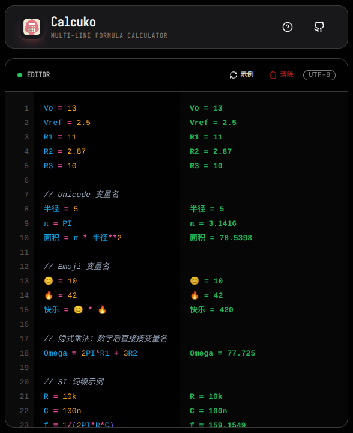

<div align="center">
  
  <h1>Calcuko（算子）- 多行变量公式计算器</h1>
</div>

> **在线体验地址：[https://Nigh.github.io/calcuko/](https://Nigh.github.io/calcuko/)**

> [!NOTE]
> 本项目受 [calctus](https://github.com/shapoco/calctus) 启发而开发。  
> 本人是`calctus`的重度用户，但是由于其为`C#`开发，只支持`Windows`环境，所以`Calcuko`作为一个跨平台的方案可以用于满足在其他平台上的公式计算需求。

Calcuko 是一款专为工程师、学生和开发者设计的轻量级、响应式多行公式计算器。它允许你像写代码一样编写计算逻辑，支持变量定义、实时求值以及自动依赖联动，并可以作为 PWA 应用安装到手机或电脑上离线使用。




## ✨ 核心特性

- **🚀 实时联动计算**：修改任意一行的数值，后续所有依赖该变量的行都会瞬间自动更新。
- **📝 混合编写模式**：支持 `变量 = 表达式` 赋值模式，也支持纯表达式直接求值。
- **🎨 智能语法高亮**：变量、运算符、数值和注释一目了然，并支持**配对括号高亮**，防止逻辑错误。
- **📱 离线优先 (PWA)**：支持安装到桌面或主屏幕，无需网络即可随时进行复杂计算。
- **💾 本地持久化**：你的计算公式会自动保存到浏览器，下次打开即刻继续工作。
- **💬 注释支持**：使用 `//` 记录你的思路或参数含义。

## 🚀 快速上手

### 1. 基础计算
直接输入公式即可查看结果：
```javascript
(12 + 8) * 5 / 2
sqrt(144) + pow(2, 10)
```

### 2. 变量定义与引用
像写脚本一样定义变量：
```javascript
price = 199
count = 3
tax = 0.08

total = price * count * (1 + tax)
```

### 3. 注释与复杂逻辑
```javascript
// 输入参数
width = 50
height = 20

// 计算面积
area = width * height

// 引用上方变量
diagonal = sqrt(pow(width, 2) + pow(height, 2))
```

## 📚 内置函数参考

Calcuko 内置了标准 Math 对象的所有常量和函数：

| 类型 | 示例 |
| :--- | :--- |
| **常量** | `PI`, `E` |
| **基础函数** | `abs(x)`, `ceil(x)`, `floor(x)`, `round(x)`, `max(a, b)`, `min(a, b)` |
| **数学运算** | `sqrt(x)`, `pow(base, exp)`, `exp(x)`, `log(x)` |
| **三角函数** | `sin(x)`, `cos(x)`, `tan(x)`, `asin(x)`, `acos(x)`, `atan(x)` |

## 📦 安装与开发

如果你想本地运行或自行部署：

```bash
# 安装依赖
npm install

# 启动开发服务器
npm run dev

# 构建生产版本 (PWA)
npm run build
