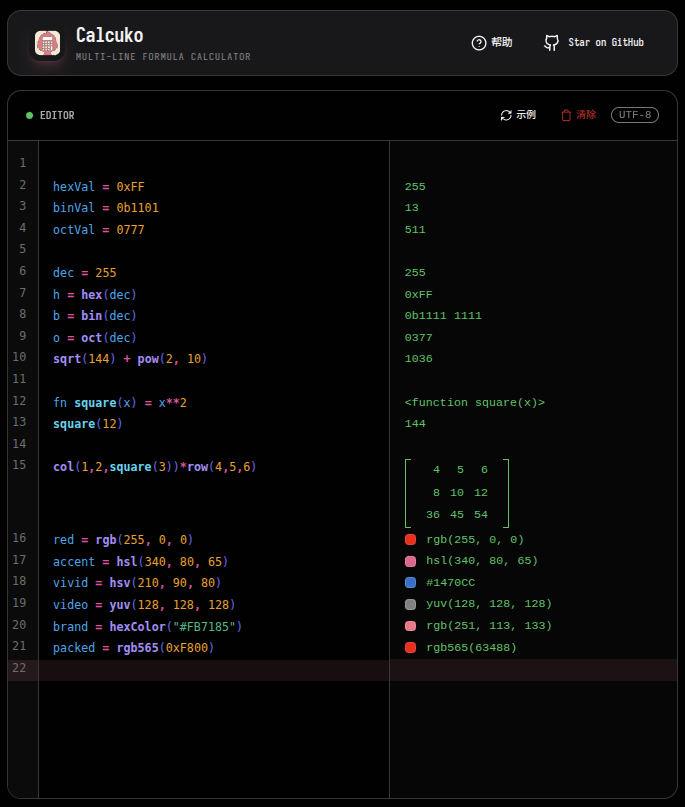

> [简体中文](./README.zh-CN.md) · [English](./README.md)

<div align="center">
  
  <h1>Calcuko — Multi-line Formula Calculator</h1>
</div>


> **Try it online: [https://Nigh.github.io/calcuko/](https://Nigh.github.io/calcuko/)**

> [!NOTE]
> Calcuko was inspired by [calctus](https://github.com/shapoco/calctus). As a cross-platform web app, Calcuko brings a similar multi-line calculation workflow to platforms beyond the original Windows-only C# application.

Calcuko is a lightweight, responsive multi-line formula calculator for engineers, students, and developers. Write calculations like code, define variables, see dependent results update instantly, and install it as a PWA for offline use on desktop or mobile.



## ✨ Features

- **🚀 Live dependency updates:** Edit any value and every later line that depends on it updates immediately.
- **📝 Flexible input:** Mix `variable = expression` assignments with standalone expressions.
- **🎨 Smart syntax highlighting:** Clearly distinguishes variables, operators, values, comments, built-in functions, and custom functions, with matching-bracket highlighting.
- **📱 Offline-first PWA:** Install Calcuko on your desktop or home screen and keep calculating without a network connection.
- **💾 Local persistence:** Formulas and result-format preferences are restored the next time you open the app.
- **💬 Line comments:** A whole line beginning with `//` after optional whitespace is a comment; `//` inside an expression is truncating integer division.
- **🛡️ Controlled evaluation:** A tokenizer, AST parser, and interpreter evaluate formulas without executing arbitrary JavaScript.
- **🔢 High-precision numbers:** Integers use arbitrary-precision BigInt, decimals use 34-digit Decimal arithmetic, and `2$3` creates an exact, automatically reduced fraction.
- **📊 Readable results:** Matrices render as tables, while numeric and color results support selectable formats, precision, radix, SI notation, and color spaces.
- **📐 Optional dimensions:** A header switch enables high-precision physical units, dimensional checks, smart simplification, and explicit conversions inspired by [Numbat](https://github.com/sharkdp/numbat).

## 🚀 Quick start

### 1. Basic calculations

Enter an expression to see its result:

```javascript
(12 + 8) * 5 / 2
sqrt(144) + pow(2, 10)
```

### 2. Variables and references

Define variables like a small script:

```javascript
price = 199
count = 3
tax = 0.08

total = price * count * (1 + tax)
```

### 3. Comments and derived values

```javascript
// Input dimensions
width = 50
height = 20

// Calculate area
area = width * height

// Reference earlier variables
diagonal = sqrt(pow(width, 2) + pow(height, 2))
```

### 4. Custom functions and lambdas

```javascript
fn square(x) = x**2
square(12)

scale = (value, factor) => value * factor
scale(10, 3)
```

### 5. Physical dimensions and units

Enable **Units** in the header, then use spaced unit expressions and `->` conversions:

```javascript
speed = 120 km/h
speed -> mph
force = 2 kg * 3 m/s^2
15 km/h * 30 min
25 degC -> degF
```

Dimensioned values participate in the same live variable workflow:

```javascript
radius = 5 m
π = PI
area = π * radius**2     // 78.5398163397448 ㎡
```

Addition and comparison require compatible dimensions, while multiplication, division, powers, arrays, matrices, statistics, and suitable math functions propagate dimensions. Results keep useful input units or simplify to common derived units. The switch defaults to off on first use and then restores the saved choice.

In dimension mode, `**` raises the complete quantity while `^` writes a unit exponent: `10 m**2` is `(10 m)**2 = 100㎡`, whereas `10 m^2` is `10㎡`. Outside dimension mode, `^` remains bitwise XOR. `10m` is still the numeric milli suffix; write `10 m` for ten metres. Supported units focus on scientific and engineering use (SI, common US/Imperial and nautical, astronomical, atomic/nuclear, and digital-information units); currencies and unrelated counting/display/humorous units are excluded.

Destructuring assigns an array to several variables at once: `[a, b, c] = [10, 20, 30]`. Both sides must have the same length; otherwise, no target is changed.

The range `1..5` excludes its endpoint, while `1..=5` includes it. Use `range(1, 5, 0.5)` for an explicit step. A range may contain at most 10,000 items.

Arrays support recursive element-wise operations and scalar broadcasting, such as `[1,2,3]*4`. Built-ins include `sum`, `ave`, `map`, `filter`, `aggregate`, `sort`, `reverse`, and `unique`.

`matrix([[1,2],[3,4]])` creates a matrix with matrix/scalar operations, matrix multiplication, and exact determinants through `det()`. The helpers `row(1,2,3)` and `col(1,2,3)` create single-row and single-column matrices.

## 📚 Built-in function reference

Spaces and `//` inside strings are preserved, as in `url = "https://example.com/a b"`.

Calcuko includes the standard JavaScript `Math` constants and functions. Engineering helpers also cover arbitrary-width bit operations and Hamming SECDED encoding and decoding through `eccEncode(width, value)` and `eccDecode(width, encoded)`.

### Color operations

Color functions support RGB (0–255), HSL/HSV (H: 0–360; other channels: 0–100), BT.601 YUV (0–255), Web Hex, and RGB565. Color results display a swatch in both the result panel and variable snapshot.

```javascript
red = rgb(255, 0, 0)
accent = hsl(340, 80, 65)
vivid = hsv(210, 90, 80)
video = yuv(128, 128, 128)
brand = hexColor("#FB7185")
packed = rgb565(0xF800)
```

Convert between color spaces and output formats with:

```javascript
toRgb(brand)
toHsl(brand)
toHsv(brand)
toYuv(brand)
toRgb565(brand)
toHexColor(brand)
```

`hexColor` accepts `#RGB` or `#RRGGBB`; `rgb565` accepts an integer from 0 to 65535. Conversion functions require a color value.

Statistics include population and sample variance/standard deviation, three kinds of mean, and median. `rand` and `randInt` use Web Crypto.

Use `solve(f)`, `solve(f, initial)`, or `solve(f, min, max)` for budgeted Newton–Raphson numerical root finding.

### Differences from Calctus

Calcuko uses its own tokenizer, AST, and controlled interpreter rather than reproducing every Calctus feature. It currently focuses on multi-line dependencies, high-precision numbers, arrays and matrices, bit operations and SECDED, colors, encoding, statistics, and numerical root finding. External scripts, date/time calculations, plotting, and the complete Calctus built-in function set are not currently supported. Comments must occupy a whole `//` line; `//` inside an expression always means integer division.

| Category | Examples |
| :--- | :--- |
| **Constants** | `PI`, `E` |
| **Basic functions** | `abs(x)`, `ceil(x)`, `floor(x)`, `round(x)`, `max(a, b)`, `min(a, b)` |
| **Math operations** | `sqrt(x)`, `pow(base, exp)`, `exp(x)`, `log(x)` |
| **Trigonometry** | `sin(x)`, `cos(x)`, `tan(x)`, `asin(x)`, `acos(x)`, `atan(x)` |

## 📦 Install and develop

```bash
# Install dependencies
npm install

# Start the development server
npm run dev

# Build the production PWA
npm run build

# Run unit tests, type checks, and browser smoke tests
npm test
npm run check
npm run test:e2e
```
